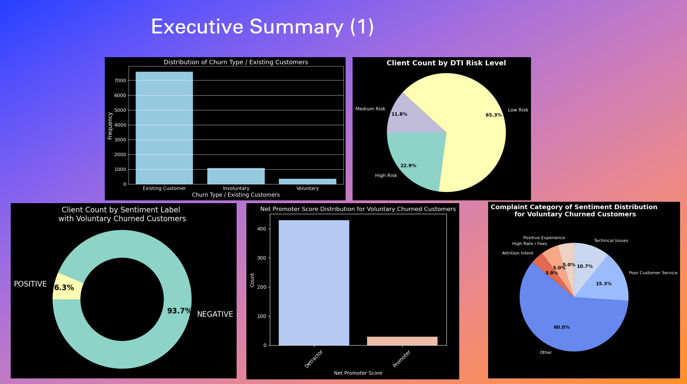
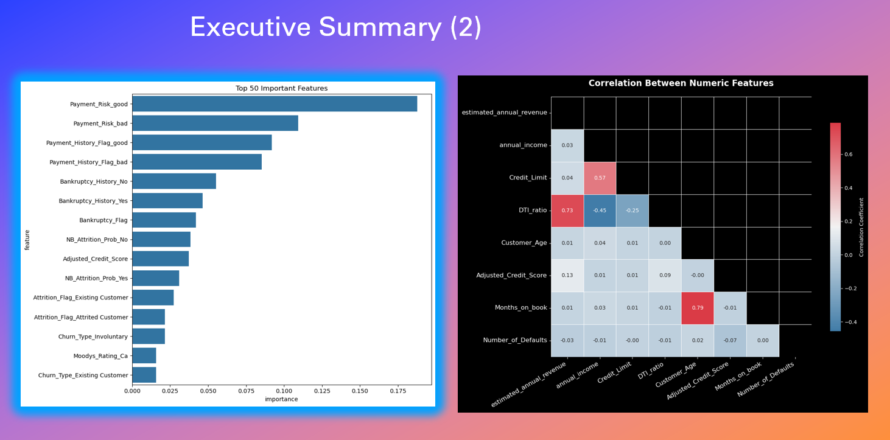

# Credit Risk, Sentiment & NPS Analysis

## 📌 Project Overview

This project analyzes **customer churn**, **credit risk**, **sentiment**, and **Net Promoter Score (NPS)** to uncover patterns in customer behavior and identify high-risk customer groups.
The analysis integrates **exploratory data analysis (EDA)**, **machine learning modeling**, and **visual insights** to support better retention strategies.

**Download:**  
- [Download PowerPoint (.pptx)](dashboard/credit_risk_sentiment_nps_analysis_result.pptx)  
- [Download PDF version](dashboard/credit_risk_sentiment_nps_analysis_result.pdf)

---

## 📂 Key Features

* **Credit Risk Profiling** – Evaluates customer Debt-to-Income (DTI), utilization, and payment history.
* **Sentiment Analysis** – Classifies customer feedback into Positive, Neutral, and Negative categories.
* **NPS Scoring** – Measures customer loyalty using Net Promoter Score.
* **Churn Prediction** – Machine learning models to identify customers likely to churn.
* **Feature Importance** – Highlights top predictors for churn, sentiment, and NPS.

---

## 📊 Data Insights

* **Top 10 Features by Churn Type** – Feature ranking via feature importance.
* **Correlation Heatmaps** – Explore relationships between key numerical features.
* **Sentiment Distribution** – Pie and bar charts of sentiment categories.
* **Customer Segmentation** – Grouping based on credit risk, sentiment, and churn status.

---

## 🛠 Tech Stack

* **Language:** Python 3.x
* **Libraries:**
  * Data: `pandas`, `numpy`
  * Visualization: `matplotlib`, `seaborn`
  * Machine Learning: `scikit-learn`
  * NLP: `nltk`, `textblob`
* **Environment:** Jupyter Notebook / Python Script

---

## 📁 Project Structure

```
credit-risk-sentiment-nps/
│-- data/                # Raw and processed datasets
│-- dashboard/           # dashboard
│-- notebooks/           # Jupyter notebooks for analysis
│-- scripts/             # Python scripts for EDA & modeling
│-- reports/             # Generated charts & plots
│-- README.md             # Project documentation
│-- requirements.txt      # Python dependencies
```

---

## 🚀 How to Run

1. Clone the repository:

```bash
git clone https://github.com/YourUsername/credit-risk-sentiment-nps.git
```

2. Install dependencies:

```bash
pip install -r requirements.txt
```

3. Run the Jupyter notebooks or Python scripts.

---

## 📌 Results Summary

* Identified **key credit and sentiment factors** driving churn.
* Sentiment analysis revealed that **negative sentiment correlates strongly** with voluntary churn.
* Sentiment analysis revealed key improvement areas, including poor customer service, technical issues, and other pain points impacting customer satisfaction.
* NPS segmentation showed that voluntary churned customers are predominantly detractors, highlighting an urgent need for targeted retention strategies and service improvements.
* Explored Top 15 Features Influencing Churn.


---

## 📄 License

This project is licensed under the MIT License — feel free to use and adapt.

---

## Dataset

The datasets used include:  
- Credit card customer information with payment history and credit limits  
- Customer feedback/review data for sentiment analysis  
- NPS survey data  

*(Note: dataset sources (https://www.kaggle.com/datasets/vikramamin/kc-house-dataset-home-prices))*

## Installation

Clone this repository:

```bash
git clone https://github.com/your-username/credit-risk-sentiment-nps.git
cd credit-risk-sentiment-nps
